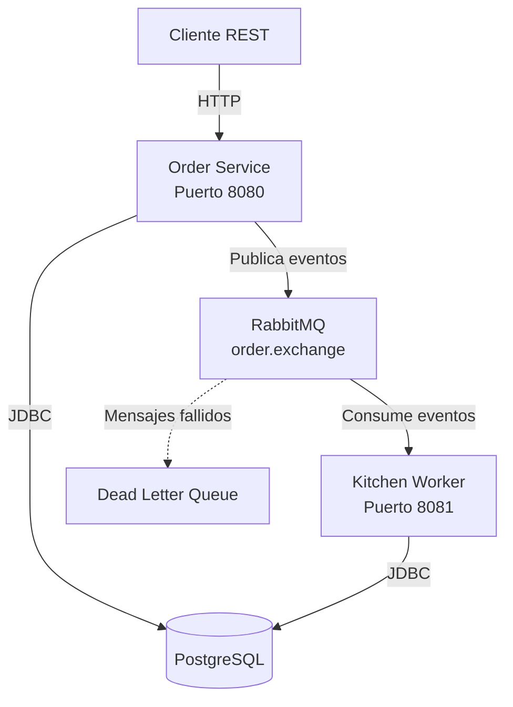
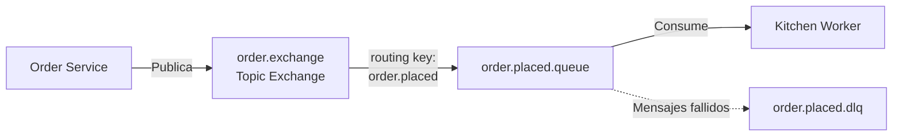
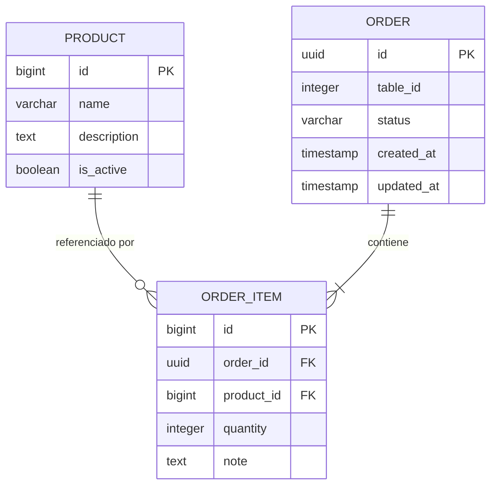

# Documento de Diseño: Sistema de Pedidos de Restaurante

## Resumen

Este documento describe el diseño de un sistema backend MVP de pedidos de restaurante utilizando arquitectura de microservicios. El sistema consta de dos microservicios Java Spring Boot que se comunican de forma asíncrona a través de RabbitMQ: Order Service (productor) que expone una API REST para gestión de pedidos, y Kitchen Worker (consumidor) que procesa eventos de pedidos. Ambos servicios comparten una base de datos PostgreSQL para persistencia de datos.

## Arquitectura

### Visión General de la Arquitectura



### Decisiones Arquitectónicas

1. **Arquitectura de Microservicios**: Separación de responsabilidades entre creación de pedidos (Order Service) y procesamiento (Kitchen Worker) para permitir escalado independiente y despliegue.

2. **Comunicación Asíncrona**: RabbitMQ proporciona desacoplamiento entre servicios, permitiendo que Order Service responda rápidamente mientras Kitchen Worker procesa pedidos en segundo plano.

3. **Base de Datos Compartida**: Para este MVP, ambos servicios comparten una base de datos PostgreSQL para simplificar la implementación. En producción, se consideraría el patrón de base de datos por servicio.

4. **Patrón Topic Exchange**: Uso de intercambio de tópicos en RabbitMQ para permitir futura extensibilidad con múltiples consumidores y patrones de enrutamiento.

5. **Dead Letter Queue**: Configuración de DLQ para capturar mensajes fallidos y permitir análisis y reprocesamiento manual.

### Stack Tecnológico

- **Lenguaje**: Java 17
- **Framework**: Spring Boot 3.x
- **Gestión de Dependencias**: Maven
- **API REST**: Spring Web
- **Persistencia**: Spring Data JPA con PostgreSQL
- **Mensajería**: Spring AMQP (RabbitMQ)
- **Migraciones**: Flyway
- **Reducción de Boilerplate**: Lombok
- **Documentación API**: SpringDoc OpenAPI (Swagger)

## Componentes e Interfaces

### Order Service

#### Responsabilidades
- Exponer API REST para gestión de pedidos
- Validar datos de entrada de pedidos
- Persistir pedidos en PostgreSQL
- Publicar eventos de pedidos a RabbitMQ
- Proporcionar documentación OpenAPI

#### Estructura de Paquetes
```
com.restaurant.orderservice
├── config
│   ├── RabbitMQConfig.java
│   └── OpenAPIConfig.java
├── controller
│   ├── MenuController.java
│   └── OrderController.java
├── dto
│   ├── CreateOrderRequest.java
│   ├── OrderItemRequest.java
│   ├── OrderResponse.java
│   ├── OrderItemResponse.java
│   ├── ProductResponse.java
│   ├── UpdateStatusRequest.java
│   └── ErrorResponse.java
├── entity
│   ├── Product.java
│   ├── Order.java
│   └── OrderItem.java
├── enums
│   └── OrderStatus.java
├── event
│   └── OrderPlacedEvent.java
├── exception
│   ├── ProductNotFoundException.java
│   ├── OrderNotFoundException.java
│   ├── InvalidOrderException.java
│   └── GlobalExceptionHandler.java
├── repository
│   ├── ProductRepository.java
│   ├── OrderRepository.java
│   └── OrderItemRepository.java
├── service
│   ├── MenuService.java
│   ├── OrderService.java
│   └── OrderEventPublisher.java
└── OrderServiceApplication.java
```

#### API REST Endpoints

**GET /menu**
- Descripción: Obtener productos activos del menú
- Respuesta: 200 OK con lista de ProductResponse
- Códigos de error: 503 Service Unavailable (BD no disponible)

**POST /orders**
- Descripción: Crear un nuevo pedido
- Request Body: CreateOrderRequest (tableId, items[])
- Respuesta: 201 Created con OrderResponse
- Códigos de error: 
  - 400 Bad Request (validación fallida)
  - 404 Not Found (producto no encontrado)
  - 503 Service Unavailable (BD no disponible)

**GET /orders/{id}**
- Descripción: Obtener pedido por ID
- Path Parameter: id (UUID)
- Respuesta: 200 OK con OrderResponse
- Códigos de error:
  - 400 Bad Request (formato UUID inválido)
  - 404 Not Found (pedido no encontrado)

**GET /orders?status={status}**
- Descripción: Listar pedidos, opcionalmente filtrados por estado
- Query Parameter: status (opcional, valores: PENDING, IN_PREPARATION, READY)
- Respuesta: 200 OK con lista de OrderResponse
- Códigos de error: 400 Bad Request (estado inválido)

**PATCH /orders/{id}/status**
- Descripción: Actualizar estado del pedido
- Path Parameter: id (UUID)
- Request Body: UpdateStatusRequest (status)
- Respuesta: 200 OK con OrderResponse
- Códigos de error:
  - 400 Bad Request (estado inválido)
  - 404 Not Found (pedido no encontrado)

#### Interfaces de Servicio

```java
public interface MenuService {
    List<ProductResponse> getActiveProducts();
}

public interface OrderService {
    OrderResponse createOrder(CreateOrderRequest request);
    OrderResponse getOrderById(UUID orderId);
    List<OrderResponse> getOrders(OrderStatus status);
    OrderResponse updateOrderStatus(UUID orderId, OrderStatus newStatus);
}

public interface OrderEventPublisher {
    void publishOrderPlacedEvent(OrderPlacedEvent event);
}
```

### Kitchen Worker

#### Responsabilidades
- Escuchar eventos "order.placed" de RabbitMQ
- Deserializar eventos JSON
- Actualizar estado de pedidos a IN_PREPARATION
- Registrar procesamiento de pedidos
- Manejar errores y reintentos

#### Estructura de Paquetes
```
com.restaurant.kitchenworker
├── config
│   └── RabbitMQConfig.java
├── entity
│   └── Order.java
├── enums
│   └── OrderStatus.java
├── event
│   └── OrderPlacedEvent.java
├── listener
│   └── OrderEventListener.java
├── repository
│   └── OrderRepository.java
├── service
│   └── OrderProcessingService.java
└── KitchenWorkerApplication.java
```

#### Interfaces de Servicio

```java
public interface OrderProcessingService {
    void processOrder(OrderPlacedEvent event);
}

@Component
public class OrderEventListener {
    @RabbitListener(queues = "${rabbitmq.queue.name}")
    public void handleOrderPlacedEvent(OrderPlacedEvent event);
}
```

### Configuración de RabbitMQ

#### Topología de Mensajería



#### Configuración de Exchange y Queue

**Exchange**:
- Nombre: `order.exchange`
- Tipo: Topic
- Durable: true
- Auto-delete: false

**Queue Principal**:
- Nombre: `order.placed.queue`
- Durable: true
- Exclusive: false
- Auto-delete: false
- Binding: routing key = `order.placed`
- DLX (Dead Letter Exchange): `order.dlx`

**Dead Letter Queue**:
- Nombre: `order.placed.dlq`
- Durable: true
- Propósito: Almacenar mensajes que fallaron después de reintentos

**Configuración de Reintentos**:
- Max intentos: 3
- Backoff inicial: 1000ms
- Multiplicador de backoff: 2.0
- Max backoff: 10000ms

## Modelos de Datos

### Esquema de Base de Datos



### Entidades JPA

#### Product
```java
@Entity
@Table(name = "products")
@Data
@NoArgsConstructor
@AllArgsConstructor
public class Product {
    @Id
    @GeneratedValue(strategy = GenerationType.IDENTITY)
    private Long id;
    
    @Column(nullable = false)
    private String name;
    
    @Column(columnDefinition = "TEXT")
    private String description;
    
    @Column(name = "is_active", nullable = false)
    private Boolean isActive = true;
}
```

#### Order
```java
@Entity
@Table(name = "orders")
@Data
@NoArgsConstructor
@AllArgsConstructor
public class Order {
    @Id
    @GeneratedValue(strategy = GenerationType.AUTO)
    private UUID id;
    
    @Column(name = "table_id", nullable = false)
    private Integer tableId;
    
    @Enumerated(EnumType.STRING)
    @Column(nullable = false)
    private OrderStatus status = OrderStatus.PENDING;
    
    @OneToMany(mappedBy = "order", cascade = CascadeType.ALL, orphanRemoval = true)
    private List<OrderItem> items = new ArrayList<>();
    
    @Column(name = "created_at", nullable = false, updatable = false)
    private LocalDateTime createdAt;
    
    @Column(name = "updated_at", nullable = false)
    private LocalDateTime updatedAt;
    
    @PrePersist
    protected void onCreate() {
        createdAt = LocalDateTime.now();
        updatedAt = LocalDateTime.now();
    }
    
    @PreUpdate
    protected void onUpdate() {
        updatedAt = LocalDateTime.now();
    }
}
```

#### OrderItem
```java
@Entity
@Table(name = "order_items")
@Data
@NoArgsConstructor
@AllArgsConstructor
public class OrderItem {
    @Id
    @GeneratedValue(strategy = GenerationType.IDENTITY)
    private Long id;
    
    @ManyToOne(fetch = FetchType.LAZY)
    @JoinColumn(name = "order_id", nullable = false)
    private Order order;
    
    @Column(name = "product_id", nullable = false)
    private Long productId;
    
    @Column(nullable = false)
    private Integer quantity;
    
    @Column(columnDefinition = "TEXT")
    private String note;
}
```

#### OrderStatus Enum
```java
public enum OrderStatus {
    PENDING,
    IN_PREPARATION,
    READY
}
```

### DTOs

#### CreateOrderRequest
```java
@Data
@NoArgsConstructor
@AllArgsConstructor
public class CreateOrderRequest {
    @NotNull(message = "Table ID is required")
    @Min(value = 1, message = "Table ID must be positive")
    private Integer tableId;
    
    @NotEmpty(message = "Order must contain at least one item")
    @Valid
    private List<OrderItemRequest> items;
}
```

#### OrderItemRequest
```java
@Data
@NoArgsConstructor
@AllArgsConstructor
public class OrderItemRequest {
    @NotNull(message = "Product ID is required")
    private Long productId;
    
    @NotNull(message = "Quantity is required")
    @Min(value = 1, message = "Quantity must be at least 1")
    private Integer quantity;
    
    private String note;
}
```

#### OrderResponse
```java
@Data
@Builder
public class OrderResponse {
    private UUID id;
    private Integer tableId;
    private OrderStatus status;
    private List<OrderItemResponse> items;
    private LocalDateTime createdAt;
    private LocalDateTime updatedAt;
}
```

#### OrderPlacedEvent
```java
@Data
@NoArgsConstructor
@AllArgsConstructor
public class OrderPlacedEvent implements Serializable {
    private UUID orderId;
    private Integer tableId;
    private List<OrderItemEventData> items;
    private LocalDateTime createdAt;
    
    @Data
    @NoArgsConstructor
    @AllArgsConstructor
    public static class OrderItemEventData implements Serializable {
        private Long productId;
        private Integer quantity;
    }
}
```

### Migraciones Flyway

#### V1__create_products_table.sql
```sql
CREATE TABLE products (
    id BIGSERIAL PRIMARY KEY,
    name VARCHAR(255) NOT NULL,
    description TEXT,
    is_active BOOLEAN NOT NULL DEFAULT true
);
```

#### V2__create_orders_table.sql
```sql
CREATE TABLE orders (
    id UUID PRIMARY KEY,
    table_id INTEGER NOT NULL,
    status VARCHAR(50) NOT NULL,
    created_at TIMESTAMP NOT NULL,
    updated_at TIMESTAMP NOT NULL
);

CREATE INDEX idx_orders_status ON orders(status);
CREATE INDEX idx_orders_created_at ON orders(created_at);
```

#### V3__create_order_items_table.sql
```sql
CREATE TABLE order_items (
    id BIGSERIAL PRIMARY KEY,
    order_id UUID NOT NULL,
    product_id BIGINT NOT NULL,
    quantity INTEGER NOT NULL,
    note TEXT,
    FOREIGN KEY (order_id) REFERENCES orders(id) ON DELETE CASCADE,
    FOREIGN KEY (product_id) REFERENCES products(id)
);

CREATE INDEX idx_order_items_order_id ON order_items(order_id);
```

#### V4__insert_initial_products.sql
```sql
INSERT INTO products (name, description, is_active) VALUES
('Pizza Margherita', 'Pizza clásica con tomate, mozzarella y albahaca', true),
('Hamburguesa Clásica', 'Hamburguesa de carne con lechuga, tomate y queso', true),
('Ensalada César', 'Ensalada fresca con pollo, parmesano y aderezo César', true);
```


## Propiedades de Corrección

Una propiedad es una característica o comportamiento que debe mantenerse verdadero en todas las ejecuciones válidas de un sistema; esencialmente, una declaración formal sobre lo que el sistema debe hacer. Las propiedades sirven como puente entre especificaciones legibles por humanos y garantías de corrección verificables por máquinas.

### Propiedad 1: Filtrado de productos activos en menú

*Para cualquier* conjunto de productos en la base de datos, cuando se llame al endpoint /menu, todos los productos devueltos deben tener isActive = true.

**Valida: Requisitos 1.3**

### Propiedad 2: Validación de productos en creación de pedidos

*Para cualquier* solicitud de creación de pedido, si algún productId referenciado no existe o tiene isActive = false, entonces el pedido debe ser rechazado con un error 400.

**Valida: Requisitos 2.2, 2.6**

### Propiedad 3: Creación completa de pedidos válidos

*Para cualquier* solicitud de creación de pedido con datos válidos (tableId positivo, productos existentes y activos, lista de items no vacía), el pedido persistido debe tener: (1) un UUID único, (2) estado PENDING, (3) createdAt y updatedAt establecidos, y (4) todos los items asociados correctamente.

**Valida: Requisitos 2.3, 2.4, 2.5**

### Propiedad 4: Validación de tableId en creaci��n de pedidos

*Para cualquier* solicitud de creación de pedido con tableId nulo, cero o negativo, el pedido debe ser rechazado con un error 400.

**Valida: Requisitos 2.7**

### Propiedad 5: Publicación de eventos para pedidos exitosos

*Para cualquier* pedido creado exitosamente, debe publicarse un evento "order.placed" a RabbitMQ con la clave de enrutamiento correcta.

**Valida: Requisitos 3.1**

### Propiedad 6: Contenido completo de eventos de pedidos

*Para cualquier* evento "order.placed" publicado, la carga útil debe contener orderId, tableId, array de items (con productId y quantity), y createdAt.

**Valida: Requisitos 3.3**

### Propiedad 7: Serialización JSON de eventos (Round Trip)

*Para cualquier* objeto OrderPlacedEvent válido, serializar a JSON y luego deserializar debe producir un objeto equivalente.

**Valida: Requisitos 3.5, 7.2**

### Propiedad 8: Recuperación completa de pedidos existentes

*Para cualquier* pedido existente en la base de datos, cuando se recupere por su ID, la respuesta debe contener todos los campos (id, tableId, status, items con todos sus detalles, createdAt, updatedAt).

**Valida: Requisitos 4.2**

### Propiedad 9: Error 404 para pedidos inexistentes

*Para cualquier* UUID que no corresponda a un pedido existente, la llamada a GET /orders/{id} debe devolver un código de estado 404.

**Valida: Requisitos 4.3**

### Propiedad 10: Filtrado correcto por estado

*Para cualquier* conjunto de pedidos en la base de datos y cualquier valor de estado válido (PENDING, IN_PREPARATION, READY), cuando se llame a GET /orders?status={status}, todos los pedidos devueltos deben tener exactamente ese estado.

**Valida: Requisitos 5.2, 5.4**

### Propiedad 11: Validación de estado inválido en filtrado

*Para cualquier* valor de estado que no sea PENDING, IN_PREPARATION o READY, la llamada a GET /orders?status={status} debe devolver un código de estado 400.

**Valida: Requisitos 5.5**

### Propiedad 12: Actualización válida de estado de pedidos

*Para cualquier* pedido existente y cualquier valor de estado válido (PENDING, IN_PREPARATION, READY), cuando se actualice el estado del pedido, tanto el campo status como updatedAt deben cambiar, y updatedAt debe ser posterior a su valor anterior.

**Valida: Requisitos 6.2, 6.3**

### Propiedad 13: Error 404 en actualización de pedido inexistente

*Para cualquier* UUID que no corresponda a un pedido existente, la llamada a PATCH /orders/{id}/status debe devolver un código de estado 404.

**Valida: Requisitos 6.4**

### Propiedad 14: Validación de estado inválido en actualización

*Para cualquier* valor de estado que no sea PENDING, IN_PREPARATION o READY, la llamada a PATCH /orders/{id}/status debe devolver un código de estado 400.

**Valida: Requisitos 6.5**

### Propiedad 15: Procesamiento de eventos actualiza estado correctamente

*Para cualquier* evento OrderPlacedEvent con un orderId que existe en la base de datos, cuando el Kitchen Worker procese el evento, el estado del pedido debe cambiar a IN_PREPARATION y updatedAt debe actualizarse.

**Valida: Requisitos 7.4, 7.5**

### Propiedad 16: Manejo de eventos con pedidos inexistentes

*Para cualquier* evento OrderPlacedEvent con un orderId que no existe en la base de datos, cuando el Kitchen Worker procese el evento, debe reconocer el mensaje sin lanzar excepciones (manejo graceful).

**Valida: Requisitos 7.6**

## Manejo de Errores

### Estrategia de Manejo de Errores

El sistema implementa un manejo de errores consistente y predecible a través de un GlobalExceptionHandler que captura excepciones y las convierte en respuestas HTTP apropiadas.

### Excepciones Personalizadas

```java
public class ProductNotFoundException extends RuntimeException {
    public ProductNotFoundException(Long productId) {
        super("Product not found with id: " + productId);
    }
}

public class OrderNotFoundException extends RuntimeException {
    public OrderNotFoundException(UUID orderId) {
        super("Order not found with id: " + orderId);
    }
}

public class InvalidOrderException extends RuntimeException {
    public InvalidOrderException(String message) {
        super(message);
    }
}
```

### GlobalExceptionHandler

```java
@RestControllerAdvice
public class GlobalExceptionHandler {
    
    @ExceptionHandler(ProductNotFoundException.class)
    public ResponseEntity<ErrorResponse> handleProductNotFound(ProductNotFoundException ex) {
        ErrorResponse error = ErrorResponse.builder()
            .timestamp(LocalDateTime.now())
            .status(HttpStatus.NOT_FOUND.value())
            .error("Not Found")
            .message(ex.getMessage())
            .build();
        return ResponseEntity.status(HttpStatus.NOT_FOUND).body(error);
    }
    
    @ExceptionHandler(OrderNotFoundException.class)
    public ResponseEntity<ErrorResponse> handleOrderNotFound(OrderNotFoundException ex) {
        ErrorResponse error = ErrorResponse.builder()
            .timestamp(LocalDateTime.now())
            .status(HttpStatus.NOT_FOUND.value())
            .error("Not Found")
            .message(ex.getMessage())
            .build();
        return ResponseEntity.status(HttpStatus.NOT_FOUND).body(error);
    }
    
    @ExceptionHandler(InvalidOrderException.class)
    public ResponseEntity<ErrorResponse> handleInvalidOrder(InvalidOrderException ex) {
        ErrorResponse error = ErrorResponse.builder()
            .timestamp(LocalDateTime.now())
            .status(HttpStatus.BAD_REQUEST.value())
            .error("Bad Request")
            .message(ex.getMessage())
            .build();
        return ResponseEntity.status(HttpStatus.BAD_REQUEST).body(error);
    }
    
    @ExceptionHandler(MethodArgumentNotValidException.class)
    public ResponseEntity<ErrorResponse> handleValidationErrors(MethodArgumentNotValidException ex) {
        List<String> errors = ex.getBindingResult()
            .getFieldErrors()
            .stream()
            .map(FieldError::getDefaultMessage)
            .collect(Collectors.toList());
        
        ErrorResponse error = ErrorResponse.builder()
            .timestamp(LocalDateTime.now())
            .status(HttpStatus.BAD_REQUEST.value())
            .error("Validation Failed")
            .message(String.join(", ", errors))
            .build();
        return ResponseEntity.status(HttpStatus.BAD_REQUEST).body(error);
    }
    
    @ExceptionHandler(DataAccessException.class)
    public ResponseEntity<ErrorResponse> handleDatabaseErrors(DataAccessException ex) {
        ErrorResponse error = ErrorResponse.builder()
            .timestamp(LocalDateTime.now())
            .status(HttpStatus.SERVICE_UNAVAILABLE.value())
            .error("Service Unavailable")
            .message("Database service is temporarily unavailable")
            .build();
        return ResponseEntity.status(HttpStatus.SERVICE_UNAVAILABLE).body(error);
    }
    
    @ExceptionHandler(Exception.class)
    public ResponseEntity<ErrorResponse> handleGenericError(Exception ex) {
        ErrorResponse error = ErrorResponse.builder()
            .timestamp(LocalDateTime.now())
            .status(HttpStatus.INTERNAL_SERVER_ERROR.value())
            .error("Internal Server Error")
            .message("An unexpected error occurred")
            .build();
        return ResponseEntity.status(HttpStatus.INTERNAL_SERVER_ERROR).body(error);
    }
}
```

### Manejo de Errores en Kitchen Worker

El Kitchen Worker implementa manejo de errores robusto para procesamiento de mensajes:

```java
@Service
@Slf4j
public class OrderProcessingService {
    
    @Autowired
    private OrderRepository orderRepository;
    
    public void processOrder(OrderPlacedEvent event) {
        try {
            Optional<Order> orderOpt = orderRepository.findById(event.getOrderId());
            
            if (orderOpt.isEmpty()) {
                log.error("Order not found for event: orderId={}", event.getOrderId());
                // Acknowledge message to prevent reprocessing
                return;
            }
            
            Order order = orderOpt.get();
            order.setStatus(OrderStatus.IN_PREPARATION);
            orderRepository.save(order);
            
            log.info("Order processed successfully: orderId={}, tableId={}", 
                event.getOrderId(), event.getTableId());
                
        } catch (Exception ex) {
            log.error("Error processing order event: orderId={}, error={}", 
                event.getOrderId(), ex.getMessage());
            throw ex; // Re-throw to trigger retry mechanism
        }
    }
}
```

### Códigos de Estado HTTP

| Código | Situación |
|--------|-----------|
| 200 OK | Operación exitosa (GET, PATCH) |
| 201 Created | Pedido creado exitosamente |
| 400 Bad Request | Validación fallida, datos inválidos |
| 404 Not Found | Recurso no encontrado |
| 500 Internal Server Error | Error inesperado del servidor |
| 503 Service Unavailable | Base de datos no disponible |

## Estrategia de Pruebas

### Enfoque Dual de Pruebas

El sistema utiliza un enfoque dual complementario:

1. **Pruebas Unitarias**: Verifican ejemplos específicos, casos edge y condiciones de error
2. **Pruebas Basadas en Propiedades**: Verifican propiedades universales a través de todos los inputs

Ambos tipos de pruebas son necesarios para cobertura completa. Las pruebas unitarias capturan bugs concretos, mientras que las pruebas de propiedades verifican corrección general.

### Balance de Pruebas Unitarias

Las pruebas unitarias deben enfocarse en:
- Ejemplos específicos que demuestran comportamiento correcto
- Puntos de integración entre componentes
- Casos edge y condiciones de error

Las pruebas de propiedades deben enfocarse en:
- Propiedades universales que se mantienen para todos los inputs
- Cobertura completa de inputs a través de randomización

Evitar escribir demasiadas pruebas unitarias - las pruebas basadas en propiedades manejan la cobertura de muchos inputs.

### Configuración de Pruebas Basadas en Propiedades

**Biblioteca**: jqwik (biblioteca de property-based testing para Java)

**Configuración**:
- Mínimo 100 iteraciones por prueba de propiedad (debido a randomización)
- Cada prueba de propiedad debe referenciar su propiedad del documento de diseño
- Formato de etiqueta: **Feature: restaurant-order-system, Property {número}: {texto de propiedad}**
- Cada propiedad de corrección DEBE ser implementada por UNA SOLA prueba basada en propiedades

### Dependencias de Prueba (Maven)

```xml
<dependency>
    <groupId>net.jqwik</groupId>
    <artifactId>jqwik</artifactId>
    <version>1.7.4</version>
    <scope>test</scope>
</dependency>
<dependency>
    <groupId>org.springframework.boot</groupId>
    <artifactId>spring-boot-starter-test</artifactId>
    <scope>test</scope>
</dependency>
<dependency>
    <groupId>org.springframework.amqp</groupId>
    <artifactId>spring-rabbit-test</artifactId>
    <scope>test</scope>
</dependency>
```

### Estructura de Pruebas

```
src/test/java/com/restaurant/orderservice
├── property
│   ├── MenuPropertyTests.java
│   ├── OrderCreationPropertyTests.java
│   ├── OrderRetrievalPropertyTests.java
│   ├── OrderFilteringPropertyTests.java
│   ├── OrderStatusUpdatePropertyTests.java
│   └── EventPublishingPropertyTests.java
├── unit
│   ├── MenuServiceTest.java
│   ├── OrderServiceTest.java
│   ├── OrderEventPublisherTest.java
│   └── GlobalExceptionHandlerTest.java
└── integration
    └── OrderFlowIntegrationTest.java
```

### Ejemplo de Prueba de Propiedad

```java
@Property
@Label("Feature: restaurant-order-system, Property 3: Creación completa de pedidos válidos")
void validOrderCreationHasAllRequiredFields(
    @ForAll @IntRange(min = 1, max = 100) int tableId,
    @ForAll @Size(min = 1, max = 10) List<@From("validOrderItems") OrderItemRequest> items
) {
    // Arrange
    CreateOrderRequest request = new CreateOrderRequest(tableId, items);
    
    // Act
    OrderResponse response = orderService.createOrder(request);
    
    // Assert
    assertThat(response.getId()).isNotNull();
    assertThat(response.getStatus()).isEqualTo(OrderStatus.PENDING);
    assertThat(response.getCreatedAt()).isNotNull();
    assertThat(response.getUpdatedAt()).isNotNull();
    assertThat(response.getUpdatedAt()).isEqualTo(response.getCreatedAt());
    assertThat(response.getItems()).hasSize(items.size());
}
```

### Cobertura de Pruebas

**Pruebas Unitarias**:
- Servicios: MenuService, OrderService, OrderProcessingService
- Controladores: MenuController, OrderController
- Manejo de excepciones: GlobalExceptionHandler
- Publicación de eventos: OrderEventPublisher
- Escucha de eventos: OrderEventListener

**Pruebas de Propiedades**:
- Una prueba por cada propiedad de corrección (16 propiedades totales)
- Configuradas para ejecutar mínimo 100 iteraciones cada una

**Pruebas de Integración**:
- Flujo completo: crear pedido → publicar evento → procesar en Kitchen Worker → verificar estado
- Configuración de RabbitMQ con TestContainers
- Configuración de PostgreSQL con TestContainers

### Estrategia de Datos de Prueba

**Generadores jqwik personalizados**:
- Generador de productos válidos (existentes y activos)
- Generador de UUIDs de pedidos existentes
- Generador de OrderItemRequest válidos
- Generador de valores de OrderStatus
- Generador de tableIds válidos e inválidos

**Datos de prueba de inicialización**:
- Script SQL de prueba con productos de muestra
- Pedidos de muestra en diferentes estados
- Configuración de base de datos H2 en memoria para pruebas unitarias

## Configuración de Aplicación

### Order Service - application.yml

```yaml
spring:
  application:
    name: order-service
  datasource:
    url: jdbc:postgresql://localhost:5432/restaurant_db
    username: restaurant_user
    password: restaurant_pass
    driver-class-name: org.postgresql.Driver
  jpa:
    hibernate:
      ddl-auto: validate
    show-sql: false
    properties:
      hibernate:
        dialect: org.hibernate.dialect.PostgreSQLDialect
        format_sql: true
  flyway:
    enabled: true
    locations: classpath:db/migration
    baseline-on-migrate: true
  rabbitmq:
    host: localhost
    port: 5672
    username: guest
    password: guest

server:
  port: 8080

rabbitmq:
  exchange:
    name: order.exchange
  routing-key:
    order-placed: order.placed

springdoc:
  api-docs:
    path: /api-docs
  swagger-ui:
    path: /swagger-ui.html
```

### Kitchen Worker - application.yml

```yaml
spring:
  application:
    name: kitchen-worker
  datasource:
    url: jdbc:postgresql://localhost:5432/restaurant_db
    username: restaurant_user
    password: restaurant_pass
    driver-class-name: org.postgresql.Driver
  jpa:
    hibernate:
      ddl-auto: validate
    show-sql: false
    properties:
      hibernate:
        dialect: org.hibernate.dialect.PostgreSQLDialect
  rabbitmq:
    host: localhost
    port: 5672
    username: guest
    password: guest
    listener:
      simple:
        retry:
          enabled: true
          initial-interval: 1000
          max-attempts: 3
          multiplier: 2.0
          max-interval: 10000

server:
  port: 8081

rabbitmq:
  exchange:
    name: order.exchange
  queue:
    name: order.placed.queue
  routing-key:
    order-placed: order.placed
  dlq:
    name: order.placed.dlq
    exchange: order.dlx
```

## Notas de Implementación

### Consideraciones de MVP

1. **Base de Datos Compartida**: Para simplificar el MVP, ambos servicios comparten la misma base de datos PostgreSQL. En un entorno de producción, se consideraría el patrón de base de datos por servicio.

2. **Lógica Mínima de Cocina**: El Kitchen Worker solo actualiza el estado a IN_PREPARATION. No hay simulación de tiempo de preparación o transiciones de estado adicionales.

3. **Sin Autenticación**: No se implementa seguridad ni autenticación en este MVP.

4. **Sin API Gateway**: Los servicios se exponen directamente sin un API Gateway.

5. **Configuración Local**: Las configuraciones asumen ejecución local con RabbitMQ y PostgreSQL en localhost.

### Orden de Implementación Recomendado

1. Configurar estructura de proyectos Maven
2. Implementar entidades JPA y migraciones Flyway
3. Implementar repositorios
4. Implementar servicios de Order Service
5. Implementar controladores de Order Service
6. Configurar RabbitMQ en Order Service
7. Implementar publicación de eventos
8. Implementar Kitchen Worker listener
9. Implementar procesamiento de eventos en Kitchen Worker
10. Agregar manejo de excepciones
11. Configurar Swagger/OpenAPI
12. Escribir pruebas unitarias
13. Escribir pruebas de propiedades
14. Escribir pruebas de integración

### Comandos de Verificación

**Iniciar PostgreSQL (Docker)**:
```bash
docker run --name restaurant-postgres -e POSTGRES_DB=restaurant_db -e POSTGRES_USER=restaurant_user -e POSTGRES_PASSWORD=restaurant_pass -p 5432:5432 -d postgres:15
```

**Iniciar RabbitMQ (Docker)**:
```bash
docker run --name restaurant-rabbitmq -p 5672:5672 -p 15672:15672 -d rabbitmq:3-management
```

**Compilar Order Service**:
```bash
cd order-service
mvn clean install
```

**Ejecutar Order Service**:
```bash
mvn spring-boot:run
```

**Compilar Kitchen Worker**:
```bash
cd kitchen-worker
mvn clean install
```

**Ejecutar Kitchen Worker**:
```bash
mvn spring-boot:run
```

**Verificar Swagger UI**:
```
http://localhost:8080/swagger-ui.html
```

**Verificar RabbitMQ Management**:
```
http://localhost:15672
Usuario: guest
Contraseña: guest
```
