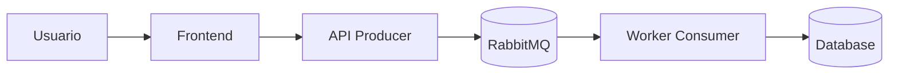

# AI_WORKFLOW.md
**Marco de trabajo de prompting AI‑First para el equipo (3 integrantes)**

> Objetivo: estandarizar cómo le pedimos a la IA que actúe como **consultor de software** y ejecute tareas operativas (código fuente, integración tecnológica, configuraciones, guías de uso), manteniendo **calidad, consistencia y trazabilidad**.

---

## Metodología

## Protocolo Spec-Driven y OpenSpec (este repo)

### 1) Que es Spec-Driven?
Es un flujo donde primero definimos el cambio con artefactos de especificacion y luego implementamos:
- proposal: por que y que cambia.
- specs: que debe hacer (requisitos + escenarios).
- design: como se va a implementar (decisiones).
- tasks: checklist de trabajo.

### 2) Como usamos OpenSpec aqui?
Usamos OpenSpec para crear y ejecutar esos artefactos de forma consistente. En este proyecto el flujo recomendado es:
1. Crear cambio
2. Completar artefactos (proposal, specs, design, tasks)
3. Aplicar cambios (implementacion)
4. Verificar
5. Archivar

### 3) Comandos que usamos (con /openspec en el chat)
- Crear cambio: /openspec new change <nombre-kebab>
- Ver estado: /openspec status --change "<nombre>"
- Ver instrucciones: /openspec instructions <artifacto> --change "<nombre>"
- Implementar: /openspec apply change <nombre>
- Verificar: /openspec verify change <nombre>
- Archivar: /openspec archive change <nombre>

Nota: si se usa CLI directo, los comandos son los mismos sin el prefijo /openspec.

### 4) Convenciones locales
- Nombre de cambio: kebab-case (ej. frontend-mockdata, docs-driven-spec).
- Ramas: feature/<scope> y PR hacia develop (GitFlow).
- Cuando verificar: antes de PR o antes de archivar, especialmente si hubo cambios grandes.

### 5) Ejemplo real (este repo)
1. /openspec new change docs-driven-spec
2. /openspec instructions proposal --change "docs-driven-spec" (crear proposal)
3. /openspec instructions specs --change "docs-driven-spec" (crear specs)
4. /openspec instructions design --change "docs-driven-spec" (crear design)
5. /openspec instructions tasks --change "docs-driven-spec" (crear tasks)
6. /openspec apply change docs-driven-spec (implementar cambios)
7. /openspec verify change docs-driven-spec (verificar)
8. /openspec archive change docs-driven-spec (cerrar el cambio)
### 6) Demo p�blica temporal (Quick Tunnel)
Cuando se necesite compartir una demo sin instalar nada:
1. Levantar el stack con Docker Compose en develop.
2. Crear t�neles con cloudflared para backend (8080) y frontend (5173).
3. Configurar .env con VITE_USE_MOCK=false, VITE_API_BASE_URL=<URL_BACKEND_PUBLICA>.
4. Para demo temporal, usar VITE_ALLOWED_HOSTS=.trycloudflare.com y CORS_ALLOWED_ORIGIN_PATTERNS=https://*.trycloudflare.com.
5. Rebuild del frontend con docker compose up -d --build frontend.

**Regla de producci�n (main):**
No usar mockdata (VITE_USE_MOCK=false).
No dejar habilitados hosts/t�neles temporales salvo que se documente la excepci�n.

### 1) Principios AI‑First (no negociables)
- **La IA es el Junior Developer**: genera boilerplate, scaffolding, pruebas base y propone integraciones.
- **El equipo es Arquitecto + Revisor**: define criterios, valida calidad, integra y corrige.
- **Regla de oro**: *prohibido escribir boilerplate a mano* si la IA lo puede generar mejor/rápido.
- **Trazabilidad**: toda decisión importante debe quedar en un documento (ADR) o en PR description.
- **Seguridad y calidad como “gates”**: linters, tests, validación de seguridad, y revisión por pares.

### 2) Ciclo de trabajo por iteración (loop corto)
**(A) Contextualizar → (B) Diseñar → (C) Generar → (D) Integrar → (E) Verificar → (F) Documentar**

1. **Contextualizar**
   - Compartir con la IA el *Context Pack* (ver sección “Documentos clave…”).
   - Definir **alcance, no‑alcance y criterios de aceptación (AC)**.
2. **Diseñar**
   - Si es arquitectura/diseño: primero **preguntas clave** (ver “Interacciones clave”).
   - Si es implementación: definir *interfaces*, contratos y responsabilidades.
3. **Generar (IA)**
   - Pedir a la IA *outputs accionables*: código por archivo, comandos, config, y tests.
4. **Integrar (humano)**
   - Aplicar cambios en el repo, resolver conflictos, ajustar detalles locales (paths, puertos, secrets).
5. **Verificar**
   - Ejecutar build + tests + smoke tests + checks de seguridad básicos.
6. **Documentar**
   - Actualizar README, ADRs, diagramas, y “prompt log” del cambio.

### 2.1) Traducir de lenguaje común a especificación técnica
Cuando el request venga en lenguaje común, la IA debe hacer esta “traducción” antes de implementar:

- **Resumen en lenguaje común**: qué entendió y qué va a construir (1–2 párrafos).
- **Criterios de aceptación traducidos**: bullets verificables.
- **Lista de decisiones técnicas** (si aplica): stack, componentes, contratos, almacenamiento, colas/eventos.
- **Preguntas faltantes**: máximo 8, enfocadas en impacto real (no jerga).

### 3) Contrato de salida (cómo debe responder la IA)
Cuando pidamos implementación, la IA debe responder **siempre** con:

1. **Plan de cambios** (qué se va a tocar y por qué).
2. **Árbol de archivos afectado** (nuevo/modificado).
3. **Código fuente por archivo** (con rutas explícitas).
4. **Configuraciones** (Docker/Docker Compose, variables de entorno, propiedades, etc.).
5. **Comandos de ejecución** (build/test/run) y *smoke test*.
6. **Checklist de verificación** (qué revisar para declarar “Done”).
7. **Riesgos y supuestos** (si aplica) + siguiente paso recomendado.

> **Formato recomendado**:  
> - Encabezado por archivo: `### path/to/file.ext`  
> - Bloques de código con triple backticks y lenguaje (` ```java `, ` ```yaml `, etc.)  
> - Instrucciones en pasos numerados.

### 4) Estándares mínimos de calidad (Definition of Done)
- Compila localmente (o explica qué falta para compilar).
- Pruebas unitarias base (o test harness mínimo) + evidencia de ejecución (comandos).
- Estilo/lint aplicado (o instrucciones para aplicarlo).
- No se exponen secretos: usar `.env.example` / placeholders.
- README actualizado para correr el módulo en local.
- Si se cambian contratos (API/eventos): **actualizar spec** (OpenAPI/AsyncAPI) y/o ADR.

---

## Interacciones clave

### 1) Plantilla universal de request (lenguaje común) — copiar/pegar
Usa esta plantilla para pedirle trabajo a la IA **sin tener que hablar “en modo ingeniero”**.  
La idea es que cualquiera del equipo pueda describirlo como lo contaría por WhatsApp, y la IA haga la traducción a tareas técnicas.

> Regla: **primero claridad en lenguaje común**, luego (si aplica) la IA lo convierte a especificación técnica.

```text
ROL: Actúa como consultor de software. Responde con pasos claros y cosas listas para usar (código/config/comandos).
MI PEDIDO (en una frase):
- [Qué quiero lograr]

PARA QUÉ (por qué lo necesitamos):
- [Qué problema resuelve / qué mejora]

CÓMO DEBERÍA FUNCIONAR (ejemplo real):
- Como [tipo de usuario], quiero [acción] para [resultado].
- Ejemplo: “Entro, creo una tarea, la mando a procesar y luego veo el resultado.”

QUÉ DEBE PASAR / QUÉ NO DEBE PASAR:
- Debe pasar:
- No debe pasar (errores que NO queremos, cosas prohibidas):

QUÉ YA TENEMOS (si lo sabes):
- Pantallas/endpoints que ya existen:
- Datos que ya guardamos:
- Qué parte funciona y cuál está fallando:

LIMITACIONES (si aplica):
- Tiempo / fecha límite:
- Presupuesto / costo máximo (si hay):
- Lo vamos a correr en: (mi laptop / servidor / nube / ambos)

EVIDENCIA / INSUMOS:
- [pego logs, screenshots, links, estructura de carpetas o snippets]

SALIDA ESPERADA:
- Dame: plan, archivos a crear/modificar, código por archivo, configuraciones, comandos para correrlo y probarlo.
- Si te falta información: hazme preguntas primero (máx. 8) y lista supuestos.
- Si el pedido es “de arquitectura/diseño”: primero haz preguntas y luego propones opciones con trade‑offs.
```

**Cómo debe empezar la IA (siempre):**
1) Repetir el pedido en sus palabras (lenguaje común) para confirmar entendimiento.  
2) Hacer preguntas si falta algo importante.  
3) Entregar la solución con **código + configuración + pasos de ejecución**.

### 2) Interacción para arquitectura (OBLIGATORIA: preguntas antes de proponer) (OBLIGATORIA: preguntas antes de proponer)
Cuando el tema sea arquitectura/diseño, la IA debe **primero** responder con preguntas clave.  
**No debe proponer una solución final hasta tener contexto suficiente.**

**Preguntas mínimas (en lenguaje común):**
1. ¿Qué problema estamos resolviendo y para quién? (¿quién lo va a usar?)
2. ¿Qué tiene que poder hacer la persona paso a paso? (flujo “normal”)
3. ¿Qué cosas pueden salir mal o pasar raro? (ej. “se cae internet”, “se duplica el envío”, “el usuario se equivoca”)
4. ¿Cuánta gente lo usará al mismo tiempo? (poco / medio / mucho, o un número aproximado)
5. ¿Qué tan grave es si se cae? (¿se puede caer 5 min? ¿debe estar siempre arriba?)
6. ¿Qué información vamos a guardar? ¿por cuánto tiempo? ¿necesitamos historial/auditoría?
7. ¿Se conecta con otros sistemas? ¿cuáles? (login, pagos, correos, CRM, etc.)
8. ¿Qué es lo mínimo que debemos entregar primero (MVP) y qué dejamos para después?

> Nota: si el equipo sí conoce detalles técnicos (latencia, volúmenes, consistencia), se pueden agregar, pero **no son obligatorios** para iniciar.

**Después de las respuestas**, la IA debe entregar:
- Arquitectura propuesta (componentes, límites, contratos).
- Decisiones clave y trade‑offs.
- Diagrama (Mermaid/PlantUML) + instrucciones para renderizarlo.
- Lista de riesgos + mitigaciones.

### 3) Interacción para creación de código (feature / “hazlo funcionar”)
**Objetivo**: pedir código listo para integrar, describiendo el comportamiento en lenguaje común.

**Qué incluir en el request (simple):**
- ¿Dónde va el cambio? (nombre del servicio o carpeta si la conoces).
- ¿Qué quieres que pase exactamente? (pasos y resultado esperado).
- ¿Qué significa “listo”? (criterios de aceptación en bullets).
- ¿Qué no se debe tocar? (cosas que no queremos cambiar).
- Si tienes ejemplos: un JSON, un mensaje, una captura o un log.

**Qué puede incluirse “si lo sabes” (opcional):**
- Versión de lenguaje/framework, puertos, DB/broker, nombres de módulos, etc.

**Salida esperada (mínimo):**
- Árbol de archivos + qué cambia.
- Código por archivo (rutas claras).
- Configuración necesaria (`.env.example`, `docker-compose.yml`, `application.yml`, etc.).
- Comandos para correrlo y probarlo.
- Tests base y datos de prueba (si aplica).

### 4) Interacción para integración de tecnologías (broker, DB, auth, observabilidad) (broker, DB, auth, observabilidad)
**Siempre pedir**: configuración + guía operativa.

La respuesta debe incluir:
- Dependencias (build) y por qué.
- Archivos de configuración (ej. `application.yml`, `.env.example`, `docker-compose.yml`).
- Pasos de instalación/ejecución local.
- Verificación: comandos + ejemplos de request/evento.
- Troubleshooting: 3–5 fallas típicas y cómo detectarlas.

### 5) Interacción para debugging (cuando “no funciona”)
**Qué pasarle a la IA (en lenguaje común, pero con evidencia):**
- ¿Qué estabas haciendo cuando falló? (paso a paso)
- ¿Qué esperabas que pasara?
- ¿Qué pasó realmente? (mensaje en pantalla, error, comportamiento raro)
- Copia/pega del error o logs (si existen)
- ¿Qué cambió recientemente? (hoy/ayer: config, dependencias, código)
- ¿En qué ambiente pasa? (mi laptop, Docker, servidor, nube)

**La IA debe responder:**
- 3 causas probables (ordenadas de más a menos probable).
- Pasos de diagnóstico (rápidos y concretos).
- Arreglo propuesto con código/config.
- Cómo evitar que vuelva a pasar (test, validación, check de CI).

### 6) Interacción para revisión de PR / refactor
La IA debe entregar:
- Observaciones por severidad (Blocker / Major / Minor).
- Riesgos (breaking changes, performance, seguridad).
- Recomendaciones con ejemplos de código.
- Checklist de “merge ready”.

### 7) Respuestas visuales o gráficas (diagrama/manual)
Si se requiere algo “visual”, la IA debe:
- Proponer el diagrama como **código** (Mermaid o PlantUML).
- Incluir **manual** para renderizar:
  - GitHub: Mermaid en Markdown (si aplica).
  - Mermaid Live Editor / PlantUML server.
  - Export a PNG/SVG.
- Acompañar con interpretación breve (qué muestra y por qué).

Ejemplo Mermaid (C4-ish simplificado):


---

## Documentos clave y contextualización

### 1) Context Pack (lo que SIEMPRE se le pasa a la IA)
Mantener un paquete mínimo de contexto para evitar “respuestas genéricas”:

- **README.md**: cómo correr el proyecto, puertos, dependencias, comandos.
- **ARCHITECTURE.md** (o `docs/architecture/`): visión general, límites, decisiones.
- **ADR/**: decisiones relevantes (tecnología, patrones, trade‑offs).
- **SPECs**:
  - API: OpenAPI (`openapi.yaml/json`).
  - Eventos: AsyncAPI (si aplica) o contrato de eventos en `docs/events/`.
- **.env.example**: variables requeridas con valores dummy.
- **docker-compose.yml**: infraestructura local (broker, db, observabilidad, etc.).
- **CONTRIBUTING.md**: reglas de branch/PR, lint, test, convenciones.
- **PROMPT_LOG.md** (o carpeta `docs/prompt-log/`): prompts usados + links a PR/commits.

> Regla práctica: antes de pedir un cambio, pegar a la IA **(a)** el árbol del repo relevante y **(b)** el contenido de archivos clave que afectan el cambio.

### 2) Estructura recomendada de documentación
```
/docs
  /adr
    0001-contexto-y-stack.md
    0002-contrato-eventos.md
  /architecture
    ARCHITECTURE.md
    DIAGRAMS.md
  /events
    events.md
    asyncapi.yaml
  /runbooks
    local-setup.md
    troubleshooting.md
  /prompt-log
    2026-02-04-feature-x.md
```

### 3) ADR (Architecture Decision Record) mínimo
Cada ADR debe responder:
- Contexto / problema
- Decisión
- Opciones consideradas
- Consecuencias / trade‑offs
- Fecha y responsable(s)

### 4) Cómo “contextualizar” bien un prompt (anti‑alucinación)
Antes de pedir código:
- Adjuntar el **contrato** (API/evento) o definirlo explícitamente.
- Decir **versiones** exactas (lenguaje/framework/broker).
- Indicar **límites**: módulos/servicios tocados y los que NO se tocan.
- Pegar *snippets* reales de interfaces/clases existentes (si hay).

---

## Dinámicas de interacción

### 1) Roles rotativos (equipo de 3)
Rotar por iteración (ej. diaria o por feature):

- **Driver (Implementación)**: integra el código generado por IA al repo.
- **Navigator (Prompt + Arquitectura)**: construye prompts, define AC, y guía el diseño.
- **QA (Validación)**: revisa AC, ejecuta pruebas, valida seguridad/estrés básico, y aprueba PR.

> Regla: ningún PR se aprueba sin revisión de al menos 1 par (idealmente QA).

### 2) Flujo de trabajo (Git Flow)
- `main`: estable/producción
- `develop`: integración
- `feature/<scope>`: cada componente o historia
- PR obligatorio hacia `develop`, con:
  - descripción del cambio
  - checklist “Done”
  - evidencia de ejecución (comandos) y screenshots/logs si aplica
  - link al prompt log / ADR si aplica

### 3) Ritual de interacción con la IA (pair prompting)
1. Navigator arma el prompt con la plantilla universal.
2. Driver valida que el prompt incluye rutas, AC y restricciones.
3. IA responde con plan + código por archivo + comandos.
4. Driver integra en repo.
5. QA corre validaciones y reporta issues.
6. Se itera con prompts de corrección (debug/refactor) hasta cumplir AC.

### 4) Gestión de prompts (prompt log)
Para cada feature/cambio relevante:
- Guardar el prompt final y la salida relevante en `docs/prompt-log/<fecha>-<tema>.md`
- Incluir:
  - contexto usado
  - prompt final
  - resumen de cambios
  - links a PR/commit
  - lecciones aprendidas (qué prompt funcionó / qué no)

### 5) Protocolo de Quality Gate (Puerta de Calidad)

**Objetivo:** La IA actúa como "Quality Gate" antes de cada commit, validando que el código cumple con estándares de calidad y no introduce deuda técnica imprudente.

#### Cuándo Activar el Quality Gate

**OBLIGATORIO antes de:**
- Commit de código nuevo
- Merge de PR
- Deploy a cualquier ambiente

**Proceso:**

1. **Solicitar Revisión a la IA**
   ```
   ROL: Actúa como Quality Gate. Revisa el siguiente código/cambio antes de commit.
   
   CÓDIGO/CAMBIO:
   [pegar código o descripción del cambio]
   
   CONTEXTO:
   - Feature: [nombre]
   - Archivos modificados: [lista]
   - Tipo de cambio: [nuevo/refactor/fix]
   
   VALIDA:
   1. Cumplimiento de estándares de código
   2. No introduce deuda técnica imprudente
   3. Tests adecuados
   4. Documentación actualizada
   5. Seguridad básica
   6. Rendimiento aceptable
   ```

2. **La IA Debe Responder Con:**
   - ✅ **APROBADO** (puede hacer commit) o ❌ **RECHAZADO** (requiere cambios)
   - Lista de issues encontrados por severidad (Blocker/Major/Minor)
   - Recomendaciones de mejora
   - Deuda técnica identificada (si aplica)

3. **Criterios de Aprobación:**
   - ✅ Sin issues Blocker
   - ✅ Tests pasando
   - ✅ Lint/format OK
   - ✅ Sin deuda técnica Imprudente y Deliberada
   - ✅ Documentación actualizada

#### Checklist de Quality Gate

**Antes de pedir código**
- [ ] AC claros y verificables
- [ ] Rutas/archivos objetivo definidos
- [ ] Versiones y restricciones definidas
- [ ] Contratos (API/eventos) definidos

**Antes de commit (Quality Gate)**
- [ ] Build OK
- [ ] Tests OK (cobertura mínima 70%)
- [ ] Lint/format OK
- [ ] Sin code smells críticos
- [ ] Sin vulnerabilidades de seguridad
- [ ] Rendimiento aceptable (sin N+1, sin memory leaks)
- [ ] Documentación actualizada (README, ADR, comentarios)
- [ ] No introduce deuda técnica Imprudente
- [ ] Revisión de IA completada y aprobada

**Antes de merge**
- [ ] Quality Gate pasado
- [ ] PR description completa
- [ ] Review de al menos 1 par
- [ ] CI/CD pasando
- [ ] README actualizado (si cambió setup/uso)
- [ ] ADR/spec actualizado (si cambió una decisión/contrato)
- [ ] Deuda técnica documentada (si se introduce)

### 6) Gestión de Deuda Técnica

**Documento de Referencia:** `DEUDA_TECNICA.md`

#### Identificación de Deuda

La IA debe identificar y clasificar deuda técnica según el Cuadrante de Martin Fowler:

1. **Prudente y Deliberada:** Decisión consciente por razones de negocio
2. **Prudente e Inadvertida:** Aprendizaje post-implementación
3. **Imprudente y Deliberada:** Decisión consciente de hacer algo mal (EVITAR)
4. **Imprudente e Inadvertida:** Falta de conocimiento

#### Proceso de Registro

Cuando la IA identifica deuda técnica:

1. **Clasificar** según cuadrante de Fowler
2. **Documentar** en `DEUDA_TECNICA.md`:
   - ID único (DT-XXX)
   - Descripción del problema
   - Cuadrante y justificación
   - Impacto (negocio y técnico)
   - Solución propuesta
   - Costo estimado de pago
   - Trigger para pago
3. **Notificar** al equipo en PR description
4. **Priorizar** según matriz de impacto vs esfuerzo

#### Política de Deuda

**PROHIBIDO:**
- Agregar deuda Imprudente y Deliberada sin aprobación del Product Owner
- Dejar deuda sin documentar
- Ignorar deuda de severidad Alta por más de 1 sprint

**OBLIGATORIO:**
- Documentar toda deuda en `DEUDA_TECNICA.md`
- Pagar deuda crítica antes de agregar nuevas features
- Dedicar 20% del tiempo a pagar deuda técnica
- Revisar deuda en cada retrospectiva

#### Ejemplo de Prompt para Identificar Deuda

```
ROL: Actúa como auditor de deuda técnica.

CÓDIGO:
[pegar código]

ANALIZA:
1. ¿Hay deuda técnica en este código?
2. Si sí, clasifícala según el Cuadrante de Fowler
3. Justifica la clasificación
4. Estima el costo de pago
5. Propón solución
6. Define trigger para pago

FORMATO DE SALIDA:
- Deuda identificada: [sí/no]
- Cuadrante: [Prudente/Imprudente] y [Deliberada/Inadvertida]
- Justificación: [explicación]
- Impacto: [Alto/Medio/Bajo]
- Costo de pago: [horas estimadas]
- Solución propuesta: [descripción]
- Trigger: [cuándo pagar]
```

### 7) Manejo de ambigüedad (cuando la IA debe preguntar)
La IA debe detenerse y preguntar cuando falte:
- Volumen/escala (impacta arquitectura)
- Contrato de eventos/API
- Restricciones de stack/versiones
- Reglas de negocio
- Límite de servicios/módulos

---

### Apéndice: pautas de estilo para respuestas con código
- Usar bloques de código por archivo con lenguaje correcto.
- Incluir rutas absolutas dentro del repo.
- Nunca incluir secretos reales.
- Preferir cambios “pequeños e integrables” por iteraciones.

---
**Última actualización:** 2026-02-06


