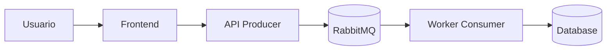

# AI_WORKFLOW.md
**Marco de trabajo de prompting AI‚ÄëFirst para el equipo (3 integrantes)**

> Objetivo: estandarizar cómo le pedimos a la IA que actúe como **consultor de software** y ejecute tareas operativas (código fuente, integración tecnológica, configuraciones, guías de uso), manteniendo **calidad, consistencia y trazabilidad**.

---

## Metodología

## Protocolo Spec-Driven y OpenSpec (este repo)

### 1) Que es Spec-Driven?
Es un flujo donde primero definimos el cambio con artefactos de especificacion y luego implementamos:
- proposal: por que y que cambia.
- specs: que debe hacer (requisitos + escenarios).
- design: como se va a implementar (decisiones).
- tasks: checklist de trabajo.

### 2) Como usamos OpenSpec aqui?
Usamos OpenSpec para crear y ejecutar esos artefactos de forma consistente. En este proyecto el flujo recomendado es:
1. Crear cambio
2. Completar artefactos (proposal, specs, design, tasks)
3. Aplicar cambios (implementacion)
4. Verificar
5. Archivar

### 3) Comandos que usamos (con /openspec en el chat)
- Crear cambio: /openspec new change <nombre-kebab>
- Ver estado: /openspec status --change "<nombre>"
- Ver instrucciones: /openspec instructions <artifacto> --change "<nombre>"
- Implementar: /openspec apply change <nombre>
- Verificar: /openspec verify change <nombre>
- Archivar: /openspec archive change <nombre>

Nota: si se usa CLI directo, los comandos son los mismos sin el prefijo /openspec.

### 4) Convenciones locales
- Nombre de cambio: kebab-case (ej. frontend-mockdata, docs-driven-spec).
- Ramas: feature/<scope> y PR hacia develop (GitFlow).
- Cuando verificar: antes de PR o antes de archivar, especialmente si hubo cambios grandes.

### 5) Ejemplo real (este repo)
1. /openspec new change docs-driven-spec
2. /openspec instructions proposal --change "docs-driven-spec" (crear proposal)
3. /openspec instructions specs --change "docs-driven-spec" (crear specs)
4. /openspec instructions design --change "docs-driven-spec" (crear design)
5. /openspec instructions tasks --change "docs-driven-spec" (crear tasks)
6. /openspec apply change docs-driven-spec (implementar cambios)
7. /openspec verify change docs-driven-spec (verificar)
8. /openspec archive change docs-driven-spec (cerrar el cambio)
### 6) Demo p˙blica temporal (Quick Tunnel)
Cuando se necesite compartir una demo sin instalar nada:
1. Levantar el stack con Docker Compose en develop.
2. Crear t˙neles con cloudflared para backend (8080) y frontend (5173).
3. Configurar .env con VITE_USE_MOCK=false, VITE_API_BASE_URL=<URL_BACKEND_PUBLICA>.
4. Para demo temporal, usar VITE_ALLOWED_HOSTS=.trycloudflare.com y CORS_ALLOWED_ORIGIN_PATTERNS=https://*.trycloudflare.com.
5. Rebuild del frontend con docker compose up -d --build frontend.

**Regla de producciÛn (main):**
No usar mockdata (VITE_USE_MOCK=false).
No dejar habilitados hosts/t˙neles temporales salvo que se documente la excepciÛn.

### 1) Principios AI‚ÄëFirst (no negociables)
- **La IA es el Junior Developer**: genera boilerplate, scaffolding, pruebas base y propone integraciones.
- **El equipo es Arquitecto + Revisor**: define criterios, valida calidad, integra y corrige.
- **Regla de oro**: *prohibido escribir boilerplate a mano* si la IA lo puede generar mejor/r√°pido.
- **Trazabilidad**: toda decisión importante debe quedar en un documento (ADR) o en PR description.
- **Seguridad y calidad como “gates”**: linters, tests, validación de seguridad, y revisión por pares.

### 2) Ciclo de trabajo por iteración (loop corto)
**(A) Contextualizar → (B) Diseñar → (C) Generar → (D) Integrar → (E) Verificar → (F) Documentar**

1. **Contextualizar**
   - Compartir con la IA el *Context Pack* (ver sección “Documentos clave…”).
   - Definir **alcance, no‑alcance y criterios de aceptación (AC)**.
2. **Diseñar**
   - Si es arquitectura/diseño: primero **preguntas clave** (ver “Interacciones clave”).
   - Si es implementación: definir *interfaces*, contratos y responsabilidades.
3. **Generar (IA)**
   - Pedir a la IA *outputs accionables*: código por archivo, comandos, config, y tests.
4. **Integrar (humano)**
   - Aplicar cambios en el repo, resolver conflictos, ajustar detalles locales (paths, puertos, secrets).
5. **Verificar**
   - Ejecutar build + tests + smoke tests + checks de seguridad b√°sicos.
6. **Documentar**
   - Actualizar README, ADRs, diagramas, y “prompt log” del cambio.

### 2.1) Traducir de lenguaje común a especificación técnica
Cuando el request venga en lenguaje común, la IA debe hacer esta “traducción” antes de implementar:

- **Resumen en lenguaje común**: qué entendió y qué va a construir (1–2 párrafos).
- **Criterios de aceptación traducidos**: bullets verificables.
- **Lista de decisiones técnicas** (si aplica): stack, componentes, contratos, almacenamiento, colas/eventos.
- **Preguntas faltantes**: m√°ximo 8, enfocadas en impacto real (no jerga).

### 3) Contrato de salida (cómo debe responder la IA)
Cuando pidamos implementación, la IA debe responder **siempre** con:

1. **Plan de cambios** (qué se va a tocar y por qué).
2. **Árbol de archivos afectado** (nuevo/modificado).
3. **Código fuente por archivo** (con rutas explícitas).
4. **Configuraciones** (Docker/Docker Compose, variables de entorno, propiedades, etc.).
5. **Comandos de ejecución** (build/test/run) y *smoke test*.
6. **Checklist de verificación** (qué revisar para declarar “Done”).
7. **Riesgos y supuestos** (si aplica) + siguiente paso recomendado.

> **Formato recomendado**:  
> - Encabezado por archivo: `### path/to/file.ext`  
> - Bloques de código con triple backticks y lenguaje (` ```java `, ` ```yaml `, etc.)  
> - Instrucciones en pasos numerados.

### 4) Estándares mínimos de calidad (Definition of Done)
- Compila localmente (o explica qué falta para compilar).
- Pruebas unitarias base (o test harness mínimo) + evidencia de ejecución (comandos).
- Estilo/lint aplicado (o instrucciones para aplicarlo).
- No se exponen secretos: usar `.env.example` / placeholders.
- README actualizado para correr el módulo en local.
- Si se cambian contratos (API/eventos): **actualizar spec** (OpenAPI/AsyncAPI) y/o ADR.

---

## Interacciones clave

### 1) Plantilla universal de request (lenguaje común) — copiar/pegar
Usa esta plantilla para pedirle trabajo a la IA **sin tener que hablar “en modo ingeniero”**.  
La idea es que cualquiera del equipo pueda describirlo como lo contaría por WhatsApp, y la IA haga la traducción a tareas técnicas.

> Regla: **primero claridad en lenguaje común**, luego (si aplica) la IA lo convierte a especificación técnica.

```text
ROL: Actúa como consultor de software. Responde con pasos claros y cosas listas para usar (código/config/comandos).
MI PEDIDO (en una frase):
- [Qué quiero lograr]

PARA QUÉ (por qué lo necesitamos):
- [Qué problema resuelve / qué mejora]

CÓMO DEBERÍA FUNCIONAR (ejemplo real):
- Como [tipo de usuario], quiero [acción] para [resultado].
- Ejemplo: “Entro, creo una tarea, la mando a procesar y luego veo el resultado.”

QUÉ DEBE PASAR / QUÉ NO DEBE PASAR:
- Debe pasar:
- No debe pasar (errores que NO queremos, cosas prohibidas):

QUÉ YA TENEMOS (si lo sabes):
- Pantallas/endpoints que ya existen:
- Datos que ya guardamos:
- Qué parte funciona y cuál está fallando:

LIMITACIONES (si aplica):
- Tiempo / fecha límite:
- Presupuesto / costo m√°ximo (si hay):
- Lo vamos a correr en: (mi laptop / servidor / nube / ambos)

EVIDENCIA / INSUMOS:
- [pego logs, screenshots, links, estructura de carpetas o snippets]

SALIDA ESPERADA:
- Dame: plan, archivos a crear/modificar, código por archivo, configuraciones, comandos para correrlo y probarlo.
- Si te falta información: hazme preguntas primero (máx. 8) y lista supuestos.
- Si el pedido es “de arquitectura/diseño”: primero haz preguntas y luego propones opciones con trade‑offs.
```

**Cómo debe empezar la IA (siempre):**
1) Repetir el pedido en sus palabras (lenguaje com√∫n) para confirmar entendimiento.  
2) Hacer preguntas si falta algo importante.  
3) Entregar la solución con **código + configuración + pasos de ejecución**.

### 2) Interacción para arquitectura (OBLIGATORIA: preguntas antes de proponer) (OBLIGATORIA: preguntas antes de proponer)
Cuando el tema sea arquitectura/diseño, la IA debe **primero** responder con preguntas clave.  
**No debe proponer una solución final hasta tener contexto suficiente.**

**Preguntas mínimas (en lenguaje común):**
1. ¿Qué problema estamos resolviendo y para quién? (¿quién lo va a usar?)
2. ¿Qué tiene que poder hacer la persona paso a paso? (flujo “normal”)
3. ¿Qué cosas pueden salir mal o pasar raro? (ej. “se cae internet”, “se duplica el envío”, “el usuario se equivoca”)
4. ¬øCu√°nta gente lo usar√° al mismo tiempo? (poco / medio / mucho, o un n√∫mero aproximado)
5. ¿Qué tan grave es si se cae? (¿se puede caer 5 min? ¿debe estar siempre arriba?)
6. ¿Qué información vamos a guardar? ¿por cuánto tiempo? ¿necesitamos historial/auditoría?
7. ¬øSe conecta con otros sistemas? ¬øcu√°les? (login, pagos, correos, CRM, etc.)
8. ¿Qué es lo mínimo que debemos entregar primero (MVP) y qué dejamos para después?

> Nota: si el equipo sí conoce detalles técnicos (latencia, volúmenes, consistencia), se pueden agregar, pero **no son obligatorios** para iniciar.

**Después de las respuestas**, la IA debe entregar:
- Arquitectura propuesta (componentes, límites, contratos).
- Decisiones clave y trade‚Äëoffs.
- Diagrama (Mermaid/PlantUML) + instrucciones para renderizarlo.
- Lista de riesgos + mitigaciones.

### 3) Interacción para creación de código (feature / “hazlo funcionar”)
**Objetivo**: pedir código listo para integrar, describiendo el comportamiento en lenguaje común.

**Qué incluir en el request (simple):**
- ¿Dónde va el cambio? (nombre del servicio o carpeta si la conoces).
- ¿Qué quieres que pase exactamente? (pasos y resultado esperado).
- ¿Qué significa “listo”? (criterios de aceptación en bullets).
- ¿Qué no se debe tocar? (cosas que no queremos cambiar).
- Si tienes ejemplos: un JSON, un mensaje, una captura o un log.

**Qué puede incluirse “si lo sabes” (opcional):**
- Versión de lenguaje/framework, puertos, DB/broker, nombres de módulos, etc.

**Salida esperada (mínimo):**
- Árbol de archivos + qué cambia.
- Código por archivo (rutas claras).
- Configuración necesaria (`.env.example`, `docker-compose.yml`, `application.yml`, etc.).
- Comandos para correrlo y probarlo.
- Tests base y datos de prueba (si aplica).

### 4) Interacción para integración de tecnologías (broker, DB, auth, observabilidad) (broker, DB, auth, observabilidad)
**Siempre pedir**: configuración + guía operativa.

La respuesta debe incluir:
- Dependencias (build) y por qué.
- Archivos de configuración (ej. `application.yml`, `.env.example`, `docker-compose.yml`).
- Pasos de instalación/ejecución local.
- Verificación: comandos + ejemplos de request/evento.
- Troubleshooting: 3–5 fallas típicas y cómo detectarlas.

### 5) Interacción para debugging (cuando “no funciona”)
**Qué pasarle a la IA (en lenguaje común, pero con evidencia):**
- ¿Qué estabas haciendo cuando falló? (paso a paso)
- ¿Qué esperabas que pasara?
- ¿Qué pasó realmente? (mensaje en pantalla, error, comportamiento raro)
- Copia/pega del error o logs (si existen)
- ¿Qué cambió recientemente? (hoy/ayer: config, dependencias, código)
- ¿En qué ambiente pasa? (mi laptop, Docker, servidor, nube)

**La IA debe responder:**
- 3 causas probables (ordenadas de m√°s a menos probable).
- Pasos de diagnóstico (rápidos y concretos).
- Arreglo propuesto con código/config.
- Cómo evitar que vuelva a pasar (test, validación, check de CI).

### 6) Interacción para revisión de PR / refactor
La IA debe entregar:
- Observaciones por severidad (Blocker / Major / Minor).
- Riesgos (breaking changes, performance, seguridad).
- Recomendaciones con ejemplos de código.
- Checklist de “merge ready”.

### 7) Respuestas visuales o gr√°ficas (diagrama/manual)
Si se requiere algo “visual”, la IA debe:
- Proponer el diagrama como **código** (Mermaid o PlantUML).
- Incluir **manual** para renderizar:
  - GitHub: Mermaid en Markdown (si aplica).
  - Mermaid Live Editor / PlantUML server.
  - Export a PNG/SVG.
- Acompañar con interpretación breve (qué muestra y por qué).

Ejemplo Mermaid (C4-ish simplificado):


---

## Documentos clave y contextualización

### 1) Context Pack (lo que SIEMPRE se le pasa a la IA)
Mantener un paquete mínimo de contexto para evitar “respuestas genéricas”:

- **README.md**: cómo correr el proyecto, puertos, dependencias, comandos.
- **ARCHITECTURE.md** (o `docs/architecture/`): visión general, límites, decisiones.
- **ADR/**: decisiones relevantes (tecnología, patrones, trade‑offs).
- **SPECs**:
  - API: OpenAPI (`openapi.yaml/json`).
  - Eventos: AsyncAPI (si aplica) o contrato de eventos en `docs/events/`.
- **.env.example**: variables requeridas con valores dummy.
- **docker-compose.yml**: infraestructura local (broker, db, observabilidad, etc.).
- **CONTRIBUTING.md**: reglas de branch/PR, lint, test, convenciones.
- **PROMPT_LOG.md** (o carpeta `docs/prompt-log/`): prompts usados + links a PR/commits.

> Regla pr√°ctica: antes de pedir un cambio, pegar a la IA **(a)** el √°rbol del repo relevante y **(b)** el contenido de archivos clave que afectan el cambio.

### 2) Estructura recomendada de documentación
```
/docs
  /adr
    0001-contexto-y-stack.md
    0002-contrato-eventos.md
  /architecture
    ARCHITECTURE.md
    DIAGRAMS.md
  /events
    events.md
    asyncapi.yaml
  /runbooks
    local-setup.md
    troubleshooting.md
  /prompt-log
    2026-02-04-feature-x.md
```

### 3) ADR (Architecture Decision Record) mínimo
Cada ADR debe responder:
- Contexto / problema
- Decisión
- Opciones consideradas
- Consecuencias / trade‚Äëoffs
- Fecha y responsable(s)

### 4) Cómo “contextualizar” bien un prompt (anti‑alucinación)
Antes de pedir código:
- Adjuntar el **contrato** (API/evento) o definirlo explícitamente.
- Decir **versiones** exactas (lenguaje/framework/broker).
- Indicar **límites**: módulos/servicios tocados y los que NO se tocan.
- Pegar *snippets* reales de interfaces/clases existentes (si hay).

---

## Dinámicas de interacción

### 1) Roles rotativos (equipo de 3)
Rotar por iteración (ej. diaria o por feature):

- **Driver (Implementación)**: integra el código generado por IA al repo.
- **Navigator (Prompt + Arquitectura)**: construye prompts, define AC, y guía el diseño.
- **QA (Validación)**: revisa AC, ejecuta pruebas, valida seguridad/estrés básico, y aprueba PR.

> Regla: ningún PR se aprueba sin revisión de al menos 1 par (idealmente QA).

### 2) Flujo de trabajo (Git Flow)
- `main`: estable/producción
- `develop`: integración
- `feature/<scope>`: cada componente o historia
- PR obligatorio hacia `develop`, con:
  - descripción del cambio
  - checklist “Done”
  - evidencia de ejecución (comandos) y screenshots/logs si aplica
  - link al prompt log / ADR si aplica

### 3) Ritual de interacción con la IA (pair prompting)
1. Navigator arma el prompt con la plantilla universal.
2. Driver valida que el prompt incluye rutas, AC y restricciones.
3. IA responde con plan + código por archivo + comandos.
4. Driver integra en repo.
5. QA corre validaciones y reporta issues.
6. Se itera con prompts de corrección (debug/refactor) hasta cumplir AC.

### 4) Gestión de prompts (prompt log)
Para cada feature/cambio relevante:
- Guardar el prompt final y la salida relevante en `docs/prompt-log/<fecha>-<tema>.md`
- Incluir:
  - contexto usado
  - prompt final
  - resumen de cambios
  - links a PR/commit
  - lecciones aprendidas (qué prompt funcionó / qué no)

### 5) Checklists r√°pidos
**Antes de pedir código**
- [ ] AC claros y verificables
- [ ] Rutas/archivos objetivo definidos
- [ ] Versiones y restricciones definidas
- [ ] Contratos (API/eventos) definidos

**Antes de merge**
- [ ] Build OK
- [ ] Tests OK
- [ ] Lint/format OK
- [ ] README actualizado (si cambió setup/uso)
- [ ] ADR/spec actualizado (si cambió una decisión/contrato)

### 6) Manejo de ambigüedad (cuando la IA debe preguntar)
La IA debe detenerse y preguntar cuando falte:
- Volumen/escala (impacta arquitectura)
- Contrato de eventos/API
- Restricciones de stack/versiones
- Reglas de negocio
- Límite de servicios/módulos

---

### Apéndice: pautas de estilo para respuestas con código
- Usar bloques de código por archivo con lenguaje correcto.
- Incluir rutas absolutas dentro del repo.
- Nunca incluir secretos reales.
- Preferir cambios “pequeños e integrables” por iteraciones.

---
**Última actualización:** 2026-02-06


