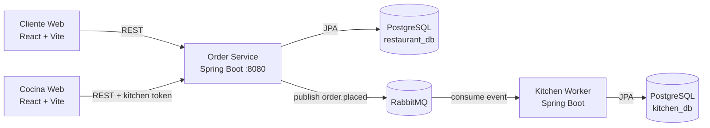
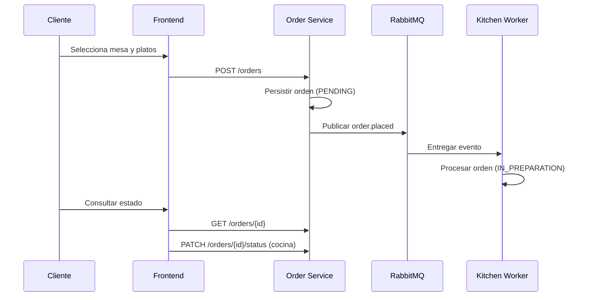

# Sistema de Pedidos de Restaurante

Frontend redisenado (React + Tailwind + shadcn), backend Spring Boot, procesamiento asincrono con RabbitMQ y despliegue reproducible con Docker Compose.

## Estado actual

- Rama objetivo de trabajo: `develop`
- Modo por defecto para produccion: **API real** (`VITE_USE_MOCK=false`)
- Stack completo en contenedores: frontend, order-service, kitchen-worker, postgres (x2), rabbitmq

## Arquitectura



## Flujo principal



## Quickstart con Docker (recomendado)

Requisitos:
- Docker Desktop en ejecucion
- Puertos libres: `5173`, `8080`, `5432`, `5433`, `5672`, `15672`

Pasos:

```bash
cp .env.example .env

docker compose -f infrastructure/docker/docker-compose.yml up -d --build

docker compose -f infrastructure/docker/docker-compose.yml ps
```

URLs:
- Frontend: `http://localhost:5173`
- API: `http://localhost:8080`
- Swagger: `http://localhost:8080/swagger-ui.html`
- RabbitMQ UI: `http://localhost:15672` (`guest/guest`)

Detener stack:

```bash
docker compose -f infrastructure/docker/docker-compose.yml down
```

## Modos de ejecucion

Variables frontend clave:
- `VITE_USE_MOCK=false` (default recomendado para `main`)
- `VITE_ALLOW_MOCK_FALLBACK=false` (sin fallback silencioso)
- `VITE_API_BASE_URL=http://localhost:8080`

Resumen:
- Modo real: `VITE_USE_MOCK=false` (usa backend y RabbitMQ)
- Modo mock dev: `VITE_USE_MOCK=true` (solo para desarrollo local)
- Fallback controlado: `VITE_ALLOW_MOCK_FALLBACK=true` (solo contingencia)

## Seguridad de cocina

Configuracion esperada:
- Header: `X-Kitchen-Token`
- Token/PIN por defecto: `cocina123`

Variables:
- Backend: `KITCHEN_TOKEN_HEADER`, `KITCHEN_AUTH_TOKEN`
- Frontend: `VITE_KITCHEN_TOKEN_HEADER`, `VITE_KITCHEN_PIN`, `VITE_KITCHEN_FIXED_TOKEN`

## Smoke test minimo (API real)

```bash
# menu
curl http://localhost:8080/menu

# crear orden
curl -X POST http://localhost:8080/orders \
  -H "Content-Type: application/json" \
  -d '{"tableId":12,"items":[{"productId":1,"quantity":2},{"productId":8,"quantity":1}]}'

# listar ordenes activas (cocina)
curl "http://localhost:8080/orders?status=PENDING,IN_PREPARATION,READY" \
  -H "X-Kitchen-Token: cocina123"
```

## Documentacion canonica

- Guia operativa rapida: `docs/development/GUIA_RAPIDA.md`
- Auditoria fase 1 (consolidada): `docs/auditoria/AUDITORIA.md`
- Calidad y pruebas (consolidado): `docs/quality/CALIDAD.md`
- Deuda tecnica (consolidada): `docs/quality/DEUDA_TECNICA.md`
- OpenSpec activo: `openspec/changes/main-production-readiness-doc-consolidation/`

## Estructura del repo

- `src/` frontend React
- `order-service/` API REST y reglas de negocio
- `kitchen-worker/` consumidor de eventos
- `infrastructure/docker/` compose y entorno local
- `docs/` entregables y soporte
- `openspec/` especificaciones y cambios
