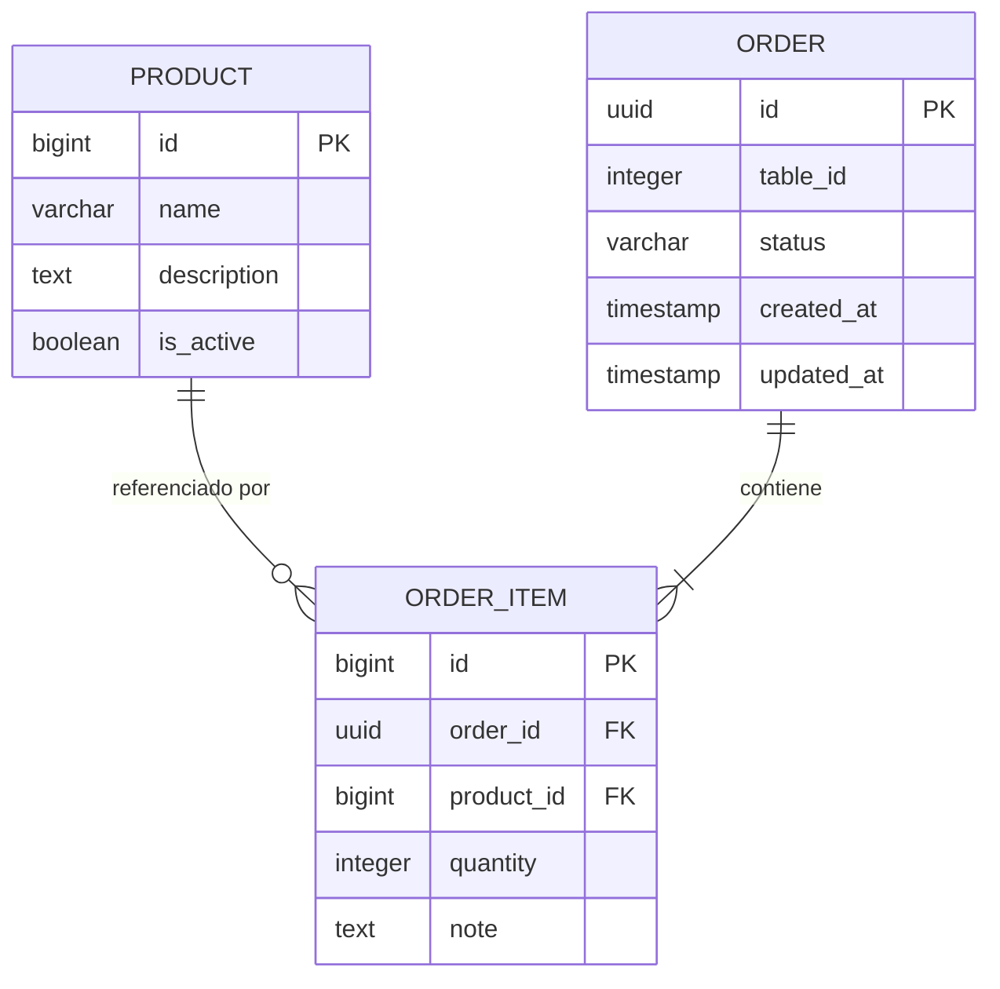

# 📋 Handover Report - Sistema de Pedidos de Restaurante

**Proyecto:** Restaurant Order System

El sistema permite gestionar pedidos en un restaurante
separando la lógica de toma de pedidos y preparación
mediante arquitectura basada en eventos.

Estado actual: MVP funcional 

---

## 🏗️ Arquitectura General

### Tipo de Proyecto
Sistema **Full-Stack** con arquitectura de **microservicios**

Componentes Principales

| Componente     | Tipo                | Tecnología        | Responsabilidad Principal | Base de Datos |
| -------------- | ------------------- | ----------------- | ------------------------- | ------------- |
| Frontend SPA   | Cliente Web         | React + Vite + TS | Interfaz cliente y cocina | —             |
| Order Service  | Microservicio REST  | Spring Boot       | Gestión de pedidos        | restaurant_db |
| RabbitMQ       | Broker              | AMQP              | Comunicación asíncrona    | —             |
| Kitchen Worker | Worker Event-Driven | Spring Boot       | Procesamiento de pedidos  | kitchen_db    |


Backend: Arquitectura Java Multi-Módulo

```
1️⃣ Order Service (Servicio Principal)
Arquitectura en Capas:
📂 order-service/src/main/java/com/restaurant/orderservice/
├── 🚪 controller/          → API REST (Endpoints HTTP)
├── 🔧 service/             → Lógica de negocio
├── 🗄️  repository/         → Acceso a datos (Spring Data JPA)
├── 📦 entity/              → Entidades JPA (tablas DB)
├── 📝 dto/                 → Data Transfer Objects
├── 🏛️  domain/             → Modelos de dominio
├── 🔐 security/            → Autenticación (Kitchen Token)
├── ⚙️  config/             → Configuración Spring
├── 🚀 application/         → Casos de uso / Application Layer
├── 🏗️  infrastructure/     → Implementaciones técnicas
├── 🚨 exception/           → Manejo de errores
└── 🔢 enums/               → Enumeraciones (OrderStatus, etc.)

```
Dependencias Principales:

Spring Boot Web → REST API
Spring Data JPA → ORM para PostgreSQL
Spring AMQP → Publicación de eventos a RabbitMQ
Spring Validation → Validación de DTOs
Flyway → Migraciones de base de datos
SpringDoc OpenAPI → Documentación Swagger
Lombok → Reducción de boilerplate
Responsabilidades:

✅ Gestionar pedidos (CRUD)
✅ Exponer menú de productos
✅ Publicar eventos order.placed a RabbitMQ
✅ Validar token de cocina (X-Kitchen-Token)

2️⃣ Kitchen Worker (Event Consumer)
Arquitectura Event-Driven:

```
📂 kitchen-worker/src/main/java/
├── 📥 consumer/            → Listeners de RabbitMQ
├── 🔧 service/             → Procesamiento de eventos
├── 🗄️  repository/         → Persistencia en kitchen_db
├── 📦 entity/              → Entidades de cocina
├── 📝 dto/                 → Eventos recibidos
└── ⚙️  config/             → Configuración AMQP

```
Dependencias Principales:

Spring Boot (sin Web, solo worker)
Spring Data JPA → Base de datos independiente
Spring AMQP → Consumo de mensajes RabbitMQ
Flyway → Migraciones
Jackson → Deserialización JSON
Responsabilidades:

✅ Escuchar eventos order.placed desde RabbitMQ
✅ Procesar pedidos y cambiar estado a IN_PREPARATION
✅ Persistir en base de datos separada (kitchen_db)

⚛️ Frontend: Arquitectura React

Build Tools:

Vite → Bundler ultrarrápido
TypeScript → Tipado estático
Tailwind CSS → Utility-first CSS
ESLint → Linting
Arquitectura Frontend (Clean Architecture)

```

📂 src/
├── 📄 pages/
│   ├── client/          → Vistas del cliente (selección menú, carrito)
│   ├── kitchen/         → Dashboard de cocina
│   └── WelcomePage.tsx  → Página inicial
│
├── 🧩 components/       → Componentes reutilizables UI
│   ├── ui/              → Componentes base (Button, Card, etc.)
│   ├── AppLayout.tsx
│   ├── TopNav.tsx
│   └── RequireKitchenAuth.tsx
│
├── 🌐 api/              → Capa de comunicación con backend
│   ├── http.ts          → Cliente HTTP (fetch wrapper)
│   ├── orders.ts        → API de pedidos
│   ├── menu.ts          → API de menú
│   ├── mock.ts          → Mock data para desarrollo
│   ├── contracts.ts     → Tipos TypeScript (contratos)
│   └── env.ts           → Variables de entorno
│
├── 🏪 store/            → Estado Global
│   ├── cart.tsx         → Context API para carrito
│   └── kitchenAuth.ts   → Autenticación de cocina
│
├── 🧠 domain/           → Lógica de dominio
│   ├── orderStatus.ts   → Mapeo de estados
│   └── productLabel.ts  → Labels de productos
│
├── 🎨 assets/           → Imágenes y recursos
│   └── menu/            → Imágenes de platos
│
└── 📱 app/
    └── context.tsx      → Context providers globales

```

```
sequenceDiagram
    participant U as 👤 Usuario
    participant F as ⚛️ Frontend
    participant O as 🍽️ Order Service
    participant R as 🐰 RabbitMQ
    participant K as 👨‍🍳 Kitchen Worker
    participant D1 as 🗄️ restaurant_db
    participant D2 as 🗄️ kitchen_db

    U->>F: Selecciona platos + mesa
    F->>F: Actualiza carrito (Context)
    U->>F: Confirma pedido
    F->>O: POST /orders
    O->>D1: INSERT orden (PENDING)
    O->>R: Publish event: order.placed
    O-->>F: 201 Created {id, status: PENDING}
    F->>U: Mostrar confirmación
    
    R->>K: Deliver event: order.placed
    K->>K: Procesar orden
    K->>D2: INSERT orden cocina (IN_PREPARATION)
    K-->>R: ACK mensaje
    
    U->>F: Consultar estado
    F->>O: GET /orders/{id}
    O->>D1: SELECT orden
    O-->>F: {status: IN_PREPARATION}
    F->>U: Actualizar UI

```


### Stack Tecnológico

**Backend:**
- Java 17
- Spring Boot 3.2.0
- Maven (Multi-módulo)
- PostgreSQL 42.7.1
- Lombok 1.18.30

**Frontend:**
- React 18+ con TypeScript
- Vite (Build tool)
- TailwindCSS
- ESLint

**Infraestructura:**
- Docker & Docker Compose
- Base de datos PostgreSQL

---


## 🔗 Dependencias Principales

### Backend (Maven)

**Framework Core:**
- `spring-boot-starter-web` → REST APIs
- `spring-boot-starter-data-jpa` → ORM/Persistencia
- `spring-boot-starter-validation` → Validaciones

**Base de Datos:**
- `postgresql:42.7.1` → Driver JDBC

**Desarrollo:**
- `lombok:1.18.30` → Reducir boilerplate (getters/setters)
- `spring-boot-devtools` → Hot reload

**Testing:**
- `jqwik:1.7.4` → Property-Based Testing (enfoque avanzado)
- `spring-boot-starter-test` → Tests unitarios e integración
- JUnit 5 (incluido en Spring Boot)

### Frontend (npm)

**Core:**
- React 18+
- TypeScript
- Vite

**UI/Estilos:**
- TailwindCSS → Framework CSS utility-first
- PostCSS → Procesamiento CSS

**Calidad:**
- ESLint → Linting JavaScript/TypeScript

---

## ⚠️ Riesgos Técnicos

### 🔴 Alto Impacto

1. **Comunicación entre microservicios no documentada**
   - ¿Cómo se comunican `order-service` y `kitchen-worker`?
   - ¿REST, eventos, mensajería (RabbitMQ/Kafka)?
   - **Acción:** Documentar protocolo de comunicación

2. **Falta de especificación OpenAPI**
   - Carpeta [openspec/](openspec/) existe pero contenido desconocido
   - **Acción:** Verificar si existe especificación Swagger/OpenAPI actualizada

3. **Configuración de entorno incompleta**
   - [.env](.env) y [.env.example](.env.example) presentes
   - **Acción:** Validar variables de entorno necesarias

### 🟡 Medio Impacto

4. **Dockerización parcial**
   - Múltiples Dockerfiles: [Dockerfile](Dockerfile), [Dockerfile.frontend](Dockerfile.frontend)
   - ¿Existe docker-compose.yml funcional?
   - **Acción:** Verificar orquestación completa

5. **Testing avanzado sin cobertura conocida**
   - Uso de jqwik (Property-Based Testing) indica madurez
   - Cobertura actual desconocida
   - **Acción:** Generar reporte de cobertura

6. **Dependencia obsolescencia**
   - Spring Boot 3.2.0 (lanzado late 2023)
   - **Acción:** Revisar actualizaciones de seguridad

### 🟢 Bajo Impacto

7. **Documentación fragmentada**
   - Existe [docs/](docs/) con auditoría, desarrollo, calidad
   - [AI_WORKFLOW.md](AI_WORKFLOW.md) sugiere flujo con IA
   - **Acción:** Consolidar documentación técnica

---

## 📊 Nivel de Calidad Actual

### ✅ Fortalezas

1. **Arquitectura moderna y escalable**
   - Microservicios bien separados
   - Java 17 (LTS) y Spring Boot 3.x

2. **Testing de calidad**
   - Uso de **jqwik** para Property-Based Testing (avanzado)
   - Framework de testing robusto

3. **Tecnologías actuales**
   - React con TypeScript (type-safety)
   - Vite (build rápido, HMR)
   - TailwindCSS (desarrollo ágil de UI)

4. **Containerización**
   - Docker setup para backend y frontend
   - Base de datos dockerizada

5. **Estructura organizada**
   - Multi-módulo Maven lógico
   - Separación de responsabilidades

---

## 📊 Modelo de Datos Simplificado

### Esquema de Base de Datos

El sistema utiliza **dos bases de datos PostgreSQL separadas** para garantizar el desacoplamiento entre servicios:

#### restaurant_db (Order Service)

```sql
-- Tabla de Productos
CREATE TABLE product (
    id BIGSERIAL PRIMARY KEY,
    name VARCHAR(255) NOT NULL,
    description TEXT,
    is_active BOOLEAN DEFAULT true
);

-- Tabla de Pedidos
CREATE TABLE "order" (
    id UUID PRIMARY KEY,
    table_id INTEGER NOT NULL CHECK (table_id BETWEEN 1 AND 12),
    status VARCHAR(20) NOT NULL,  -- PENDING, IN_PREPARATION, READY
    created_at TIMESTAMP DEFAULT CURRENT_TIMESTAMP,
    updated_at TIMESTAMP DEFAULT CURRENT_TIMESTAMP
);

-- Tabla de Items del Pedido
CREATE TABLE order_item (
    id BIGSERIAL PRIMARY KEY,
    order_id UUID NOT NULL REFERENCES "order"(id),
    product_id BIGINT NOT NULL REFERENCES product(id),
    quantity INTEGER NOT NULL CHECK (quantity > 0),
    note TEXT
);
```

#### kitchen_db (Kitchen Worker)

```sql
-- Proyección de Pedidos en Cocina
CREATE TABLE kitchen_orders (
    id UUID PRIMARY KEY,
    table_id INTEGER NOT NULL,
    status VARCHAR(20) NOT NULL,
    created_at TIMESTAMP NOT NULL,
    updated_at TIMESTAMP DEFAULT CURRENT_TIMESTAMP
);

-- Items de Pedidos en Cocina
CREATE TABLE kitchen_order_items (
    id BIGSERIAL PRIMARY KEY,
    order_id UUID NOT NULL REFERENCES kitchen_orders(id),
    product_id BIGINT NOT NULL,
    quantity INTEGER NOT NULL
);
```

### Diagrama de Relaciones



### Estados de Pedido

| Estado | Descripción | Transición Permitida |
|--------|-------------|---------------------|
| `PENDING` | Pedido creado, esperando | → `IN_PREPARATION` |
| `IN_PREPARATION` | En cocina | → `READY` |
| `READY` | Listo para servir | Estado final |

### Reglas de Negocio Críticas

1. **Validación de Mesa**: `tableId` debe estar entre 1 y 12
2. **Productos Activos**: Solo productos con `is_active = true` pueden usarse
3. **Items Mínimos**: Un pedido debe contener al menos 1 item
4. **Cantidad Positiva**: `quantity` debe ser mayor que 0
5. **Idempotencia**: Kitchen Worker debe manejar eventos duplicados

---

## 🔧 Guía Operativa

### Inicio Rápido (Modo Producción)

#### 1. Prerrequisitos

```bash
# Verificar instalaciones
docker --version  # >= 20.10
docker compose version  # >= 2.0
node --version  # >= 18 (solo si desarrollo local)
java --version  # >= 17 (solo si desarrollo local)
```

#### 2. Configuración de Entorno

```bash
# Copiar plantilla de variables
cp .env.example .env

# Variables críticas (revisar antes de ejecutar)
# VITE_USE_MOCK=false           # Modo API real
# VITE_API_BASE_URL=http://localhost:8080
# KITCHEN_TOKEN=your-secure-token-here
```

#### 3. Levantar Stack Completo

```bash
# Levantar todos los servicios
docker compose -f infrastructure/docker/docker-compose.yml up -d --build

# Verificar estado de servicios
docker compose -f infrastructure/docker/docker-compose.yml ps

# Verificar logs
docker compose -f infrastructure/docker/docker-compose.yml logs -f
```

#### 4. Validación Post-Despliegue

```bash
# Ejecutar smoke test completo
bash scripts/smoke-complete.sh

# Validaciones manuales
curl http://localhost:5173  # Frontend
curl http://localhost:8080/menu  # API
curl http://localhost:8080/swagger-ui.html  # Swagger
curl -u guest:guest http://localhost:15672/api/overview  # RabbitMQ
```

### URLs de Acceso

| Servicio | URL | Credenciales |
|----------|-----|--------------|
| Frontend Cliente | http://localhost:5173 | N/A |
| Frontend Cocina | http://localhost:5173/kitchen/login | PIN: 1234 |
| API REST | http://localhost:8080 | N/A |
| Swagger UI | http://localhost:8080/swagger-ui.html | N/A |
| RabbitMQ Management | http://localhost:15672 | guest/guest |

### Comandos de Mantenimiento

```bash
# Ver logs en tiempo real
docker compose -f infrastructure/docker/docker-compose.yml logs -f [service-name]

# Reiniciar servicio específico
docker compose -f infrastructure/docker/docker-compose.yml restart [service-name]

# Detener todo
docker compose -f infrastructure/docker/docker-compose.yml down

# Limpiar volúmenes y reiniciar desde cero
docker compose -f infrastructure/docker/docker-compose.yml down -v
docker compose -f infrastructure/docker/docker-compose.yml up -d --build
```

## 🧪 Testing

### Estrategia de Pruebas

El proyecto utiliza un enfoque **dual de testing**:

1. **Property-Based Testing** (jqwik): Valida propiedades universales del sistema
2. **Unit Testing** (JUnit 5): Valida casos específicos y edge cases

### Cobertura de Pruebas por Módulo

#### Order Service

**Pruebas Unitarias:**
- ✅ `MenuServiceTest`: Lógica de menú y productos activos
- ✅ `OrderServiceTest`: Creación, validación y procesamiento de pedidos
- ✅ `OrderEventPublisherTest`: Publicación de eventos a RabbitMQ
- ✅ `GlobalExceptionHandlerTest`: Manejo de errores HTTP


#### Kitchen Worker

**Pruebas Unitarias:**
- ✅ `OrderProcessingServiceTest`: Procesamiento de eventos
- ✅ `OrderEventListenerTest`: Consumo de eventos AMQP
- ✅ `IdempotencyTest`: Manejo de eventos duplicados

**Propiedades Validadas:**
- Eventos con `eventVersion != 1` → DLQ directo
- Procesamiento idempotente (mismo evento múltiples veces)
- Estado siempre avanza de PENDING → IN_PREPARATION

### Ejecución de Pruebas

#### Pruebas de Integración

```bash
# Script automatizado de pruebas completas
bash scripts/test-all.sh
```

**Fases del Script:**
1. ✅ Pruebas Unitarias (Order Service + Kitchen Worker)
2. ✅ Infraestructura (Docker Compose + Smoke Tests)
3. ✅ Pruebas de Integración (Flujo completo E2E)


---

## 👥 Referencias

**Documentación Técnica:**
- [README.md](README.md) - Guía de inicio
- [docs/](docs/) - Documentación adicional
- [AI_WORKFLOW.md](AI_WORKFLOW.md) - Flujo de trabajo con IA

**Archivos Clave:**
- [pom.xml](pom.xml) - Configuración Maven padre
- [package.json](package.json) - Dependencias frontend
- [.env.example](.env.example) - Variables de entorno necesarias

---
